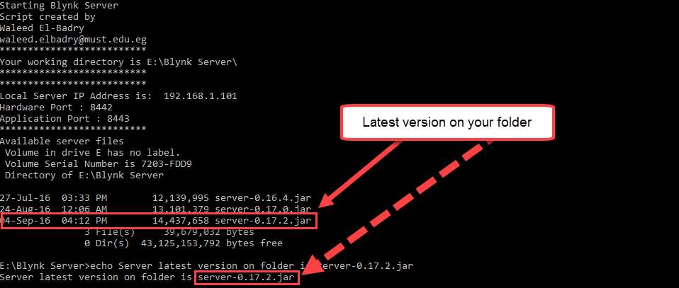
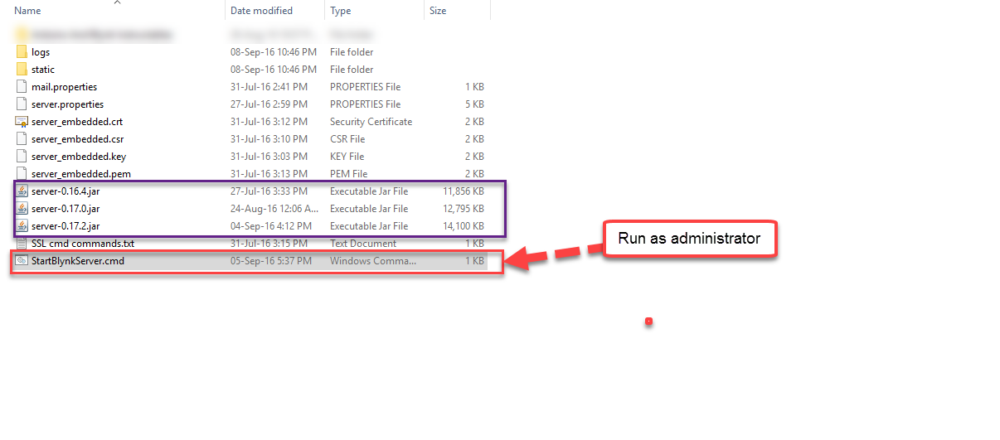

# StartBlynkServer.cmd

Este arquivo em lote permite executar o servidor local de maneira mais simples. Colocá-lo ao lado do arquivo do servidor permite:

- Exibir endereço IP do servidor
- Exibir portas de aplicativos e hardware
- Executando o servidor sem o trabalho de escrever o caminho completo
- O script agora é capaz de detectar a versão mais recente na pasta do servidor local e executá-la

